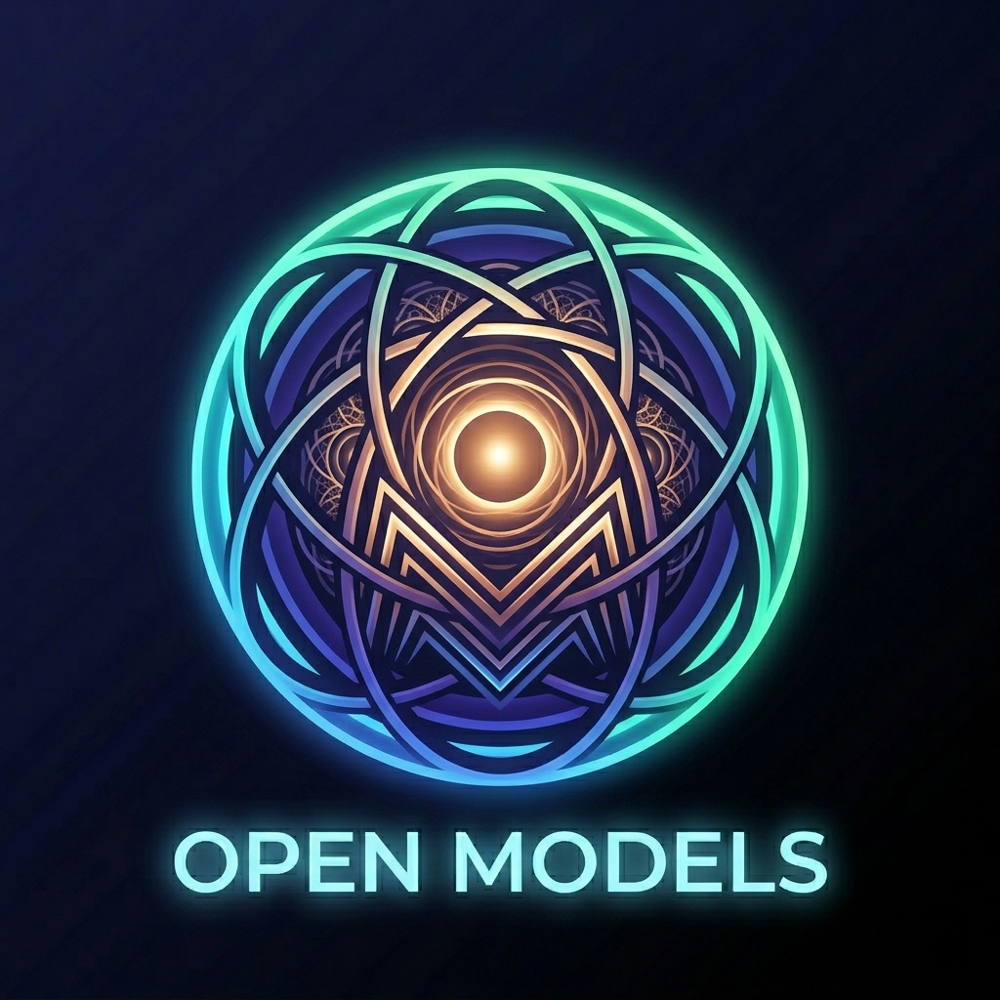

<p align="center">
  
</p>

<h1 align="center">OpenModels</h1>

<p align="center">
  <strong>Private, offline AI chat — powered by local open-source LLMs on your Android device.</em>
</p>

<p align="center">
  <a href="#features">Features</a> •
  <a href="#supported-models">Supported Models</a> •
  <a href="#architecture">Architecture</a> •
  <a href="#tech-stack">Tech Stack</a> •
  <a href="#getting-started">Getting Started</a> •
  <a href="#building-from-source">Building from Source</a>
</p>

---

OpenModels lets you run large language models entirely on-device — no internet, no cloud, no data leaving your phone. Download GGUF-format models from the built-in catalog and chat with them privately through a beautiful, responsive interface.

## Features

- **Fully Offline Inference** — All LLM processing happens locally via `llama_flutter_android`. No servers, no API keys, no privacy concerns.
- **Built-in Model Catalog** — Browse, download, and manage 16+ open-source models (Gemma, Phi, Qwen, Llama, Mistral, TinyLlama, SmolLM) with sizes from 0.5B to 7B parameters.
- **Intelligent Hardware Detection** — Automatically detects your device's RAM, CPU cores, and GPU capabilities (Vulkan/NNAPI). Disables models that can't run on your hardware to prevent OOM crashes.
- **Adaptive Performance** — Automatically selects optimal thread count based on your CPU cores for maximum inference speed.
- **Rich Markdown Rendering** — LLM responses are rendered with full Markdown support (code blocks, tables, lists, inline styling) using `markdown_widget`.
- **Chat History & Sessions** — Conversations are persisted in SQLite with model name, timestamps, message counts, and last message previews. Switch between sessions freely.
- **Streaming Responses** — See model output token-by-token as it's generated, with support for thinking/reasoning segments.
- **High-Performance Benchmark** — On-device prime computation benchmark measures your chip's capability and estimates real-world tokens-per-second for each model.
- **Dual Theme** — Beautiful light and dark themes with appropriate status bar styling for each.

## Supported Models

| Model | Parameters | Size | Min RAM |
|-------|-----------|------|---------|
| SmolLM | 135M – 360M | 56 MB – 243 MB | 1 GB |
| TinyLlama | 1.1B | 655 MB | 2 GB |
| Qwen 2.5 | 0.5B | 352 MB | 2 GB |
| Gemma 2 | 2B – 9B | 1.4 GB – 5.4 GB | 4 – 8 GB |
| Llama 3.2 / 3.1 | 1B – 8B | 684 MB – 4.7 GB | 2 – 8 GB |
| Mistral 7B | 7B | 4.1 GB | 8 GB |
| Phi 3.5 / 4 | 3.8B – 14.7B | 2.3 GB – 8.5 GB | 4 – 12 GB |

All models are in GGUF format and hosted for direct download within the app.

## Architecture

```
lib/
├── core/
│   ├── constants/          — App colors, API endpoints (model catalog)
│   ├── inference/
│   │   └── loaders/        — GGUF model loader (llama_flutter_android bindings)
│   ├── services/           — Database, benchmark, LLM output parser, native bridge
│   └── utils/              — Hardware checker, tier detection, RAM validation
├── features/
│   ├── chat/
│   │   ├── providers/      — ChatNotifier (state, sessions, inference stream)
│   │   └── widgets/        — Message bubbles, markdown renderer, AI message display
│   ├── dashboard/
│   │   └── providers/      — Diagnostics (RAM, CPU, GPU detection)
│   ├── model_manager/
│   │   ├── providers/      — Model download/load state management
│   │   └── screens/        — Model repository browser with filter/search
│   ├── settings/
│   │   └── providers/      — Temperature, top-p, max tokens, system prompt
│   └── shell/              — App shell with bottom navigation
└── main.dart               — App entry point, theme, routing
```

### State Management

Riverpod is used throughout for state management:
- `chatProvider` — Chat sessions, messages, inference lifecycle
- `modelProvider` — Download progress, loaded model state
- `diagnosticsProvider` — Hardware capability detection
- `settingsProvider` — Inference hyperparameters

### Inference Flow

1. User selects a model → hardware checker validates RAM availability
2. Model is loaded into RAM via `llama_flutter_android` native bindings
3. User sends a message → context is built (recent messages + system prompt)
4. Inference runs on a background isolate, streaming tokens to the UI
5. Response is rendered with full Markdown support in the chat bubble

## Tech Stack

| Layer | Technology |
|-------|-----------|
| **Framework** | Flutter 3.x (Dart) |
| **State Management** | Riverpod 2.x |
| **Local Database** | SQLite (sqflite) |
| **Preferences** | SharedPreferences |
| **LLM Inference** | llama_flutter_android (GGUF) |
| **GPU Acceleration** | NNAPI / Vulkan via llama.cpp |
| **Markdown Rendering** | markdown_widget |
| **Native Bridge** | Flutter MethodChannel |
| **Splash/Icon** | flutter_native_splash, flutter_launcher_icons |

## Getting Started

### Prerequisites

- Flutter SDK 3.x ([install guide](https://docs.flutter.dev/get-started/install))
- Android device or emulator (API 26+)
- At least 2 GB free storage for model downloads
- At least 3 GB RAM for running 1B+ models

### Installation

```bash
git clone https://github.com/your-username/openmodels.git
cd openmodels
flutter pub get
flutter run
```

## Building from Source

```bash
# Debug APK
flutter build apk --debug

# Release APK (requires signing)
flutter build apk --release

# App Bundle for Play Store
flutter build appbundle --release
```

## License

This project is licensed under the MIT License.
